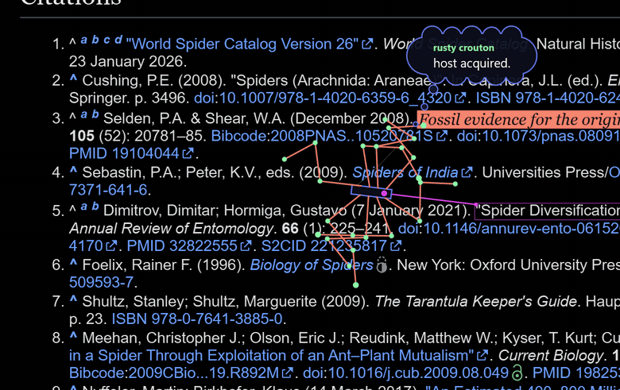
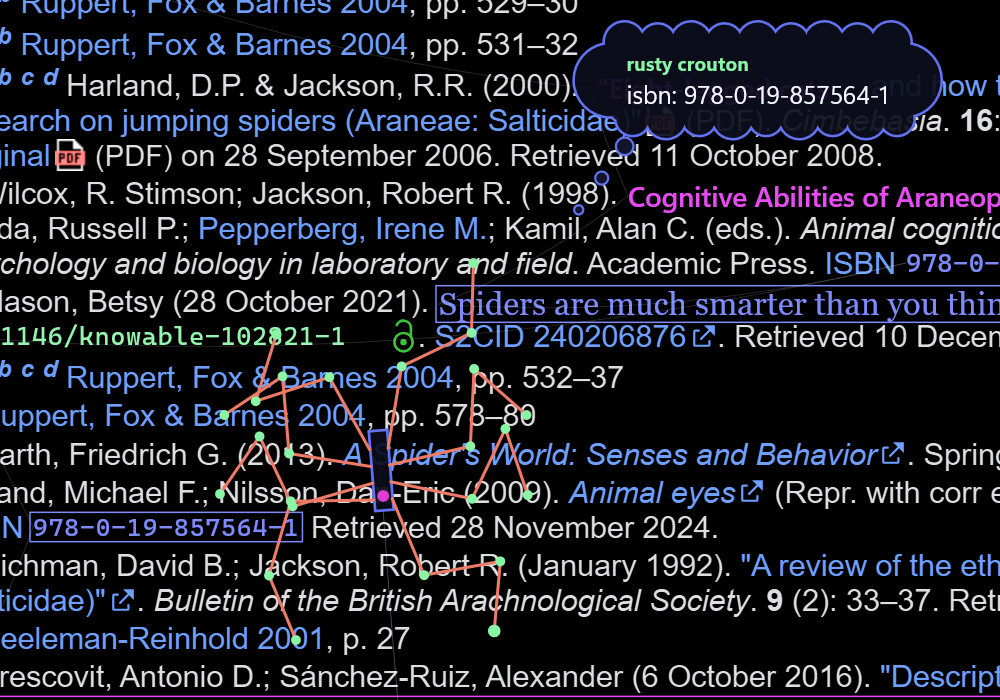
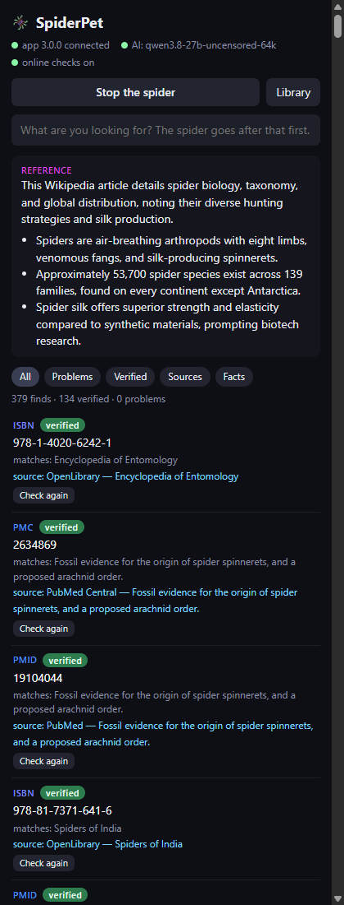
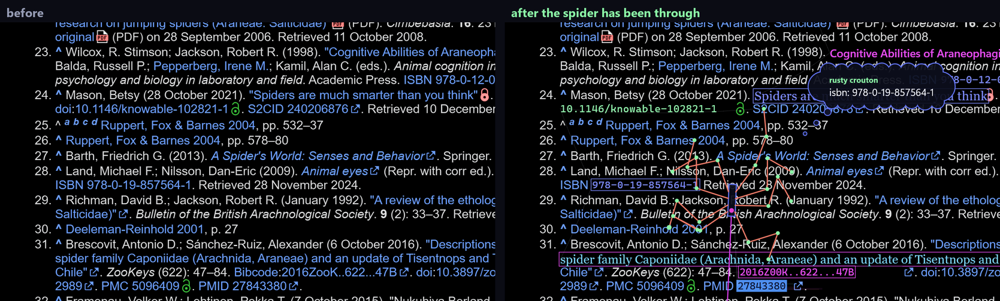
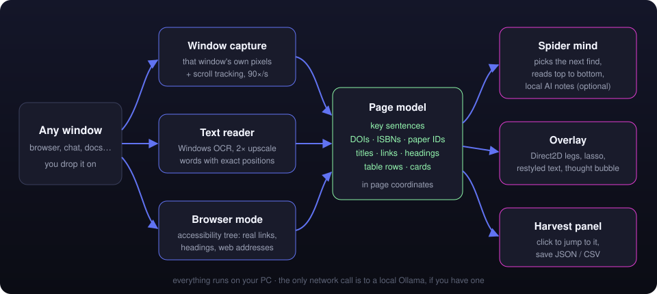

<p align="center">
  
</p>

<p align="center">
  
  
  
  
  
</p>

<p align="center">
  <b>Drop a spider on any window. It walks across the text, reads what matters,<br>
  and harvests what it finds: DOIs, ISBNs, paper IDs, titles, links, table rows and key sentences.</b>
</p>

<p align="center">
  
</p>

<p align="center">
  <a href="https://github.com/CodingIsCoolFr/SpiderPet/releases/latest"><b>⬇ Download SpiderPet.exe</b></a>
  &nbsp;·&nbsp; one file, no installer &nbsp;·&nbsp; nothing leaves your PC
</p>

---

## What it does

- **Walks on real text.** Eight jointed legs plant their feet on the letters under them. Scroll the page and it holds on.
- **Lassoes what is worth keeping.** A magenta line shoots out to a find; the find glitches and changes its look — green code for DOIs, big blue code for ISBNs, salmon for titles, boxes for links.
- **Never covers its neighbors.** It lifts the real letters out of the window's pixels and measures the clean space around them. A new font is used only where it fits in that space. Everywhere else the same letters are repainted in place, in the new color, so icons, buttons and tags stay whole.
- **Reads like a person.** It skims each paragraph for the key sentence, works top to bottom, and scrolls the page by itself to keep going.
- **Thinks out loud.** A thought bubble tells you what it is doing, in the voice of a small digital organism feeding on information: `doi: 10.1016/j.cub.2009.08.049`, `digesting: spiders use webs for hearing`, `crawling deeper.`
- **Keeps everything.** The panel lists every find. Click one and the spider takes you back to it on the page. Save as JSON or CSV.

<table>
  <tr>
    <td width="62%"></td>
    <td width="38%"></td>
  </tr>
  <tr>
    <td align="center"><sub>legs on the letters, the lasso, the thought bubble</sub></td>
    <td align="center"><sub>the harvest: click to jump, right-click to copy or open</sub></td>
  </tr>
</table>

### Before and after

<p align="center">
  
</p>

## Browser mode

Browsers publish a structured copy of every page for screen readers. SpiderPet reads it straight from the browser, in C++, with no extension to install: exact text, real headings, and the **web address of every link** — so a harvested link comes with where it goes.

- **Firefox:** the spider reads the page's own words, line by line, with their exact positions. Nothing is guessed from pixels, so every DOI, title and sentence is spelled exactly as on the page. Text the page carries but does not show (screen-reader labels, hidden menus) is left out.
- **Chrome, Brave and Edge:** these answer too slowly for a full read of every line, so the spider reads the pixels and then corrects each word against the page's own text.
- **Everywhere else** (chat apps, PDFs, documents) it reads the window with Windows OCR. The Windows spell checker repairs the usual misreads ("predatorsv" → "predators,") and drops sentences that came out garbled.

## How it works

<p align="center">
  
</p>

- **Seeing.** It captures only the window it is on (Windows.Graphics.Capture), so it never reads itself and still shows up in your screen shares. A scroll tracker matches row profiles between frames and keeps everything glued to the text while you scroll.
- **Reading.** The app's own text when it publishes it (UI Automation's text pattern), Windows OCR when it does not. The pixels place each word and give its colors. Lines become blocks, blocks become sentences, and typed finds are pulled out: DOIs, ISBNs, PMIDs, Bibcodes, titles in quotes, links by color or by the page's own link list, table rows, cards.
- **Choosing.** Each find has a value; distance, reading order and how much it already ate nearby decide what comes next.
- **Moving.** FABRIK inverse kinematics for the legs, a stepping gait that plants feet on glyphs, bursts of speed like a real spider.
- **Drawing.** A topmost, click-through Direct2D window composed with DirectComposition. It shrinks to the page it is on and steps aside for full-screen games.

## Use it

1. Run `SpiderPet.exe`. The spider drops onto your desktop and the panel opens.
   Windows may say it does not know the app: **More info → Run anyway** (it is not code-signed).
2. Drag the spider onto a window, or point at one and press **Alt + Shift + S**.
3. Watch. Drag its thought bubble to pin it; double-click the bubble to let it follow again.
4. In the panel, click a find to see it on the page, or save the whole harvest.

**Optional local AI.** With [Ollama](https://ollama.com) running and a small model such as `qwen2.5:3b`, the spider adds a 3–8 word note to each sentence it reads and a one-line gist of the page. Without it, everything else still works.

**Screen sharing.** Share your whole screen to show the spider; a single-window share only includes that window. You can hide the spider from shares in Settings.

## Build from source

Needs Visual Studio 2022 (C++), CMake 3.21+ and [vcpkg](https://vcpkg.io) with `imgui` and `nlohmann-json` for `x64-windows`.

```powershell
vcpkg install imgui nlohmann-json --triplet x64-windows
powershell -ExecutionPolicy Bypass -File build.ps1
```

`build\Release\SpiderTool.exe` is the test bench: `ocr`, `page`, `scroll`, `text` (reads a live window as page text, OCR and OCR plus page tree, side by side, without touching it), `view` (a scrollable test window) and `sim`, which films the whole pipeline over a page image without touching your screen — every image above was made with it.

```
src/core     math, time, paths
src/see      window capture, scroll tracking, Windows OCR, UI Automation
src/page     the page model: lines, blocks, sentences, typed finds, page facts
src/pet      the spider: legs and gait, behavior, persona
src/render   the overlay, drawing, restyled text, thought bubble
src/mind     local model client (Ollama over WinHTTP)
src/ui       the panel (Dear ImGui on Win32 + D3D11)
src/app      main app, harvest store, SpiderTool
```

## Privacy

SpiderPet only looks at the window you put it on. It reads pixels and the accessibility data a screen reader would use; it never reads another program's memory and never sends anything anywhere. The only network call is to a local Ollama on `127.0.0.1`, if you have one. Harvests stay in `Documents\SpiderPet` and `%APPDATA%\SpiderPet`.

## Credits

- Inspired by the node-and-line spider in [this clip by @Ufosoldier](https://x.com/Ufosoldier/status/2105902567846756439).
- Page images in the demos: the Wikipedia article [Spider](https://en.wikipedia.org/wiki/Spider), CC BY-SA 4.0.
- [Dear ImGui](https://github.com/ocornut/imgui) Win32/DX11 backends (MIT), [nlohmann/json](https://github.com/nlohmann/json) (MIT).

## License

[MIT](LICENSE)
