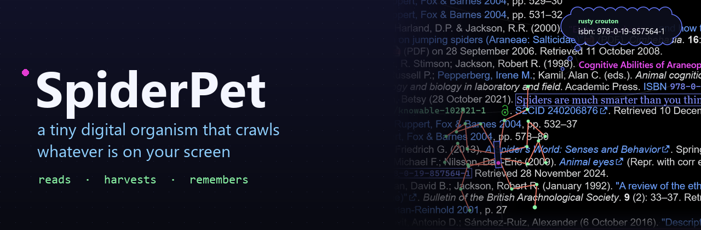
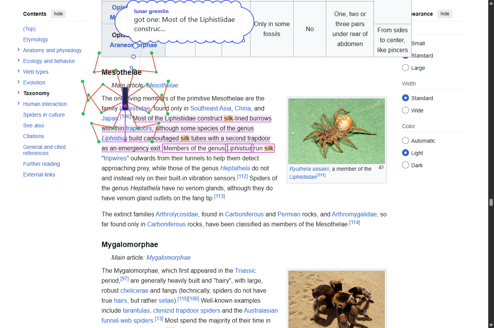
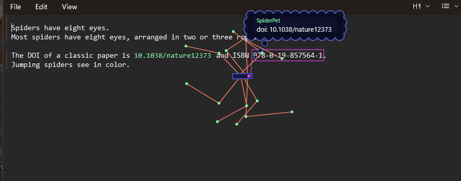
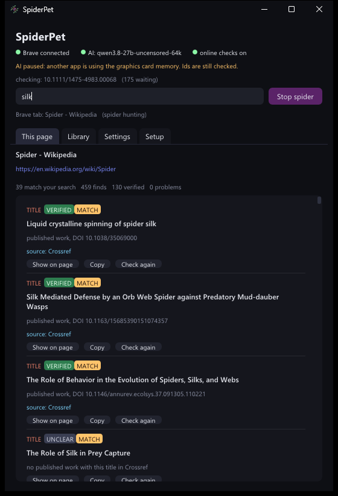

<p align="center">
  
</p>

<p align="center">
  
  
  
  
</p>

<p align="center">
  <b>Drop a spider on any window: a web page, a chat, a document, Settings, a game. It works out what the app is and<br>
  what is on it, walks across the text, harvests the DOIs, ISBNs, paper ids, titles, links and key facts, re-sets them<br>
  in place, checks every one against a real source, and does tasks for you with that window's own buttons.</b>
</p>

<p align="center">
  <br>
  <sub>every find on a tag that fits its own words, a check line under it, the verdict in the margin: never on top of the text</sub>
</p>

---

## What's new in 4.0: no extension, any window

SpiderPet used to need a browser extension. Now it is one program that reads **any** window by itself:

- **Drop it anywhere.** Press **Drop the spider** and click a window, or press **Ctrl+Alt+S** in the window you are using. Browsers, chat apps, editors, PDF readers, File Explorer, Settings.

  

- **It reads like a screen reader.** Windows' own accessibility interface (the one Narrator and NVDA use) gives the real text of the window, where every piece sits, and every button, link and box. Nothing is guessed from pixels when the text is there.
- **It reads pixels when it has to.** A game, a video or a picture shows text that interface can't see; Windows' built-in text recognition reads it then.
- **It looks with the AI's own eyes.** The local model gets a picture of the window with its text and buttons, and says which app it is, what this screen shows, what you seem to be doing, and what it could do for you there.
- **It knows what it has read.** It reads every word, link and button label in the window, not only what it highlights. It works on the part you are looking at and reads the rest out of sight. Silk in the margin marks what has been on screen; the app shows how much of the window it has read and how many finds it has eaten.

## What it does

- **Hunts for what you ask.** Type what you are looking for. Every match lights up, and the spider goes from match to match.
- **Answers questions about the window.** *What's this about?*, *what does this error mean?*: the answer comes from what the window shows, with a quote.
- **Does tasks, in any window.** Give it a goal or a command: *search the site for silk*, *click Sign in*, *type cats into the search box and press enter*, *go to wikipedia.org*. It plans, then looks before every step: a picture of the window with every button and link numbered, which screen of the page it is on, the headings, and where your words are on the whole page. It skims with **find** (the whole page at once, like Ctrl+F), uses the site's own search, searches the web kept to one site, opens the best candidates and checks them. It thinks it over at the start and whenever it gets stuck, and changes approach when it goes round in circles.
- **Asks before anything risky.** Steps that could spend money, send or post something, sign you in or up, agree to terms or accept anything, or can't be undone wait for your **Do it**. Enter waits too, since it can send a form. It never signs you out of a site, never types into a password or card box, and never answers an "are you a robot?" check. Every step it takes is written to `tasks.log`, so you can always see what it did.
- **Walks like a spider.** Eight jointed legs, coral with mint joints, a magenta lasso, a scalloped thought cloud with its thoughts typed out.
- **Re-sets what it eats.** DOIs in green code, ISBNs in bold blue code, ids on a blue chip, titles in salmon serif, each on a navy tag exactly the size of its own words, so it never covers the words around it. Links get a frame. It paints over the window; the window itself is not changed.
- **Shows every check where you can read it.** A line under each checked find, like a spell checker's: straight green when verified, wavy amber or red when wrong or not found, dotted grey for no proof. The verdict's label goes in the margin beside the paragraph, never on top of text, with a thin thread back to the find when it had to move.
- **Never draws in the wrong place.** A tracker follows the window and its scrolling about 120 times a second. While the window or its content moves, the marks step aside, and come back once they are measured where they are now. Before it draws a mark it checks that the words really show there (as Playwright checks before a click), so nothing is drawn over a pop-up or where hidden text claims to be.
- **Gets pop-ups out of the way.** Cookie boxes get a no (Reject all, Necessary only), and newsletter, app and notification pop-ups get closed, by themselves. A box that asks you to agree to terms is never agreed to for you: it waits for you. A pop-up you opened yourself is left alone. (Settings can turn this off.)
- **Keeps a library** of every find from every window, with its check and source. Search it, filter it, save it as JSON or CSV.
- **Stays with its window.** Click somewhere else and the spider stays on its window, still working; windows you put on top cover it like any window. Screen shares and recordings show it (Settings can hide it); when it takes its own picture of a window it steps out of it, so it never reads itself.
- **Stays out of the way.** Before it loads the AI it checks free graphics memory: when a game has taken it, the AI waits instead of making your PC stutter.

## How the checking works

The local AI is the judge, never the source. It only compares a find with a record or a passage that was looked up, and it has to quote what it relied on; a verdict whose quote is not really in the source is thrown out.

| Find | Looked up in | Wrong when |
|---|---|---|
| DOI | Crossref, the DOI system | the DOI does not exist, or it belongs to a different paper than the citation names |
| ISBN | check digit, OpenLibrary, Google Books | the check digit is wrong, or the book is a different one |
| PMID, PMC, arXiv id | PubMed, PubMed Central, arXiv | no such record, or a different paper |
| Citation title | Crossref | (shown as verified when a published work has that title) |
| Fact in a sentence | Wikipedia, chosen by the AI | the evidence says something incompatible |

**No proof** is not **wrong**: an id that is real, on a page that does not name the work ("the textbook, ISBN ..."), or a check the AI could not do because a game had the graphics card, says *no proof found*. Only evidence makes a find wrong.

Only the find leaves your PC (an id, a title or a few search words), never the window. Turn **Online checks** off in the app and nothing leaves at all.

<p align="center">
  <br>
  <sub>the app: which window the spider is on, how much it has read and eaten, and every find with its check and source</sub>
</p>

## Install

1. Install [Ollama](https://ollama.com) and a model with vision. The smartest one SpiderPet knows is Qwen 3.8 27B (`qwen3.8-27b-uncensored-64k`, about 13 GB, ~35 tokens/s on an RTX 4080).
2. Download **SpiderPet.exe** from the [latest release](https://github.com/CodingIsCoolFr/SpiderPet/releases/latest) and run it.
3. Press **Drop the spider** and click any window, or press **Ctrl+Alt+S** in it.

The app sits in the tray. Close its window and the spider keeps working; quit from the tray icon.

**Coming from 3.x?** The browser extension and `SpiderHost.exe` are no longer used: remove the extension from your browser and delete `SpiderHost.exe`. Your library and settings carry over.

## Build from source

Needs Visual Studio 2022 (C++ with the Windows SDK), CMake 3.21+ and [vcpkg](https://vcpkg.io) (set `VCPKG_ROOT`).

```powershell
powershell -ExecutionPolicy Bypass -File build.ps1
```

```
src/eyes    reading any window: UI Automation, screenshots, Windows OCR (and SpiderSee.exe, a test tool that prints what it sees)
src/crawl   the crawler (harvesting, the spider's walk, tasks) and the stage (the see-through layer it is drawn on)
src/app     SpiderPet.exe: window, tray, library, the jobs
src/mind    the checker: Crossref, OpenLibrary, PubMed, arXiv, Wikipedia, and the local model (text and pictures)
src/core    small helpers
```

## Privacy

Everything runs on your PC. The window's text and picture go only to Ollama on `127.0.0.1`. Each find (never the window) goes to the public sources above when Online checks are on. The library stays in `Documents\SpiderPet`, settings in `%APPDATA%\SpiderPet`.

## Credits

- How it reads windows borrows rules from three MIT projects that read Windows apps for AI agents: [Windows-MCP](https://github.com/CursorTouch/Windows-MCP) (what counts as clickable, the cycle guard, the element budget), [Cua](https://github.com/trycua/cua)'s Windows driver (a numbered list of what is on screen) and [Hermes Agent](https://github.com/NousResearch/hermes-agent) (a picture plus numbered elements for the model). The code here is SpiderPet's own.
- Drawing over other apps borrows from [Wingman](https://github.com/Raaif-Yousuf/Wingman/issues/325) (hide labels while the window moves, labels beside the text, never on it), [Hypothesis](https://web.hypothes.is/blog/fuzzy-anchoring/) (the text around a quote picks the right copy of it) and greedy label placement as chart and map labelers do it ([Kittivorawong, Moritz, Wongsuphasawat and Heer](https://idl.cs.washington.edu/files/2021-FastLabels-VIS.pdf)).
- Pop-ups: [DuckDuckGo autoconsent](https://github.com/duckduckgo/autoconsent) and [Consent-O-Matic](https://github.com/cavi-au/Consent-O-Matic) (say no to cookie boxes by themselves) and [Playwright](https://playwright.dev/docs/actionability)'s pop-up handlers and hit-target check.
- The task agent borrows ideas from [Nanobrowser](https://github.com/nanobrowser/nanobrowser) (Apache-2.0): judging the last step and keeping notes each step, marking new elements, and treating window text as untrusted; from [browser-use](https://github.com/browser-use/browser-use) (MIT): a numbered screenshot as the ground truth, search the page before scrolling, and breaking out of loops; and from Microsoft's [Magentic-One](https://github.com/microsoft/autogen) web surfer: telling the model which screen of the page it sees, and find on page.
- Inspired by the node-and-line spider in [this clip by @Ufosoldier](https://x.com/Ufosoldier/status/2105902567846756439).
- [Dear ImGui](https://github.com/ocornut/imgui) Win32/DX11 backends (MIT), [nlohmann/json](https://github.com/nlohmann/json) (MIT).
- Lookups: [Crossref](https://www.crossref.org), [OpenLibrary](https://openlibrary.org), [Google Books](https://books.google.com), [NCBI E-utilities](https://www.ncbi.nlm.nih.gov/books/NBK25501/), [arXiv](https://arxiv.org), [Wikipedia](https://www.wikipedia.org).

## License

[MIT](LICENSE)
